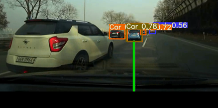
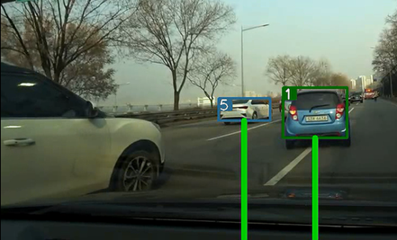
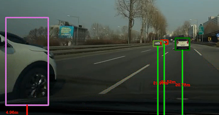

# SSAC 2차 프로젝트 
## Yolov5 + Deep Sort with PyTorch

## 소개
차량과 차선을 인식하고 화면 하단에서 차량까지에 거리를 계산하는 프로그램

## 구성 
1. kitti dataset 분석 및 데이터 활용  
   yolo_tools/analysis_label.py : kitti dataset 분석을 위한 코드   
   yolo_tools/MakeYOLOLabel.py : yolov5 학습을 위한 라벨데이터 생성 코드   
2. Yolov5 모델 학습   
   yolov5/learning_yolo5.ipynb : yolov5 학습 코드
3. 차량과 차선 인식 및 거리 계산 모델(yolov5 + deepsort)    
    track.py

## 역할
- kitti 데이터 전처리
- kitti 데이터 yolo 학습을 위한 라벨링 
- yolov5 모델 학습
- 거리 탐지 정확도를 위한 Deepsort 적용
- 학습이 잘되지 않은 데이터를 수도 레이블링을 통해서 추가 학습

## 결과 화면

Yolo 를 이용한 자동차 탐지   

   

Deepsort를 활용한 거리 탐지 개선   

   

수도레이블링을 통한 자동차 탐지   

   

### source
    https://github.com/mikel-brostrom/Yolov5_DeepSort_Pytorch
    https://github.com/ultralytics/yolov5
    video
    https://youtu.be/YsPdvvixYfo
    
